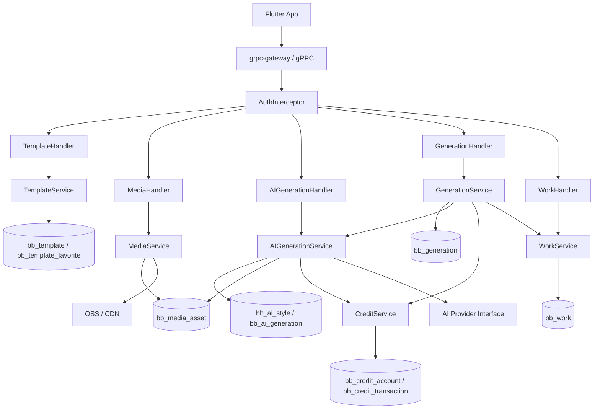
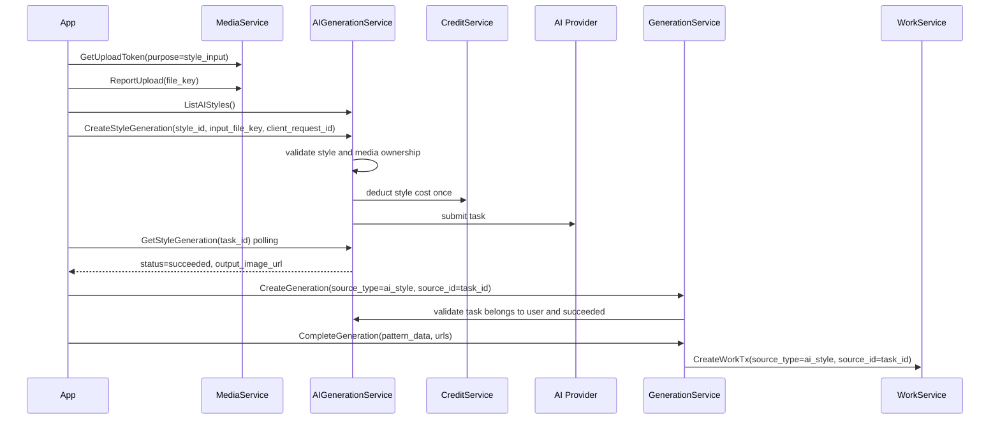
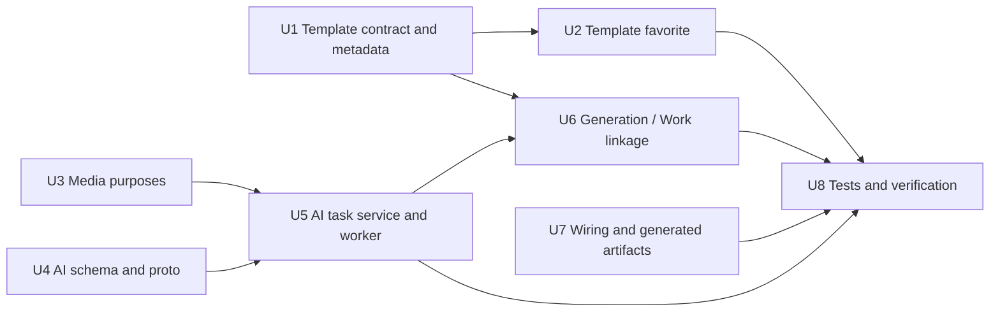

## Summary

本计划把 `doc/app_api_design.md` 中的接口方案落成可执行的后端实施步骤，目标是完成拼豆 App 的三条 P1 闭环：

1. 首页官方图纸区域可以展示后端配置的拼豆图纸，用户可以收藏、取消收藏，并在“我的收藏”查看。
2. 风格转换页可以展示后端配置的 AI 风格，用户上传图片后创建 AI 风格转换任务并轮询结果。
3. 用户把 AI 风格转换输出继续生成拼豆图纸后，服务端可以按用户管理生成记录，并在“我的”页面通过现有作品列表返回。

执行策略是复用当前代码已经成型的 `TemplateService`、`MediaService`、`GenerationService`、`WorkService`、`CreditService`，只在 AI 风格转换上新增独立 `AIGenerationService`。P1 不新增聚合型 `MeService`，客户端先组合调用已有模块，避免过早把首页、我的页、AI 任务三个业务面绑死。

---

## Current Code Snapshot

当前服务是 Go + gRPC + grpc-gateway 架构，模块路径比较稳定：

| 层 | 现状 | 本计划如何使用 |
|---|---|---|
| API 协议 | `pkg/proto/*.proto`，通过 `buf generate` 生成 `internal/pb/*` | 扩展 `template.proto`、`work.proto`、`generation.proto`，新增 `ai_generation.proto` |
| Handler | `internal/api/*` | 新增 `AIStyleGenerationHandler`，扩展 `TemplateHandler`、`GenerationHandler`、`WorkHandler` |
| Service | `internal/service/*` | 复用现有 service 边界，新增 `internal/service/ai_generation` |
| DAO | `internal/dao/*` | 扩展 `TemplateDAO`、`WorkDAO`、`GenerationDAO`，新增 `AIGenerationDAO` |
| Model | `internal/model/*` | 扩展 `Template`、`Work`，新增 `TemplateFavorite`、`AIStyle`、`AIGeneration` |
| 注册与迁移 | `internal/bootstrap/service_provider.go`、`cmd/main.go` | 新 service 注册、gRPC/gateway 注册、AutoMigrate 增加新表 |
| 测试 | `internal/test/*`，SQLite memory DB | 增加 template/media/ai_generation/generation/work 覆盖 |

关键观察：

- `TemplateService` 已有分类、列表、详情接口，适合作为官方图纸库继续扩展。
- `GetTemplateResponse` proto 已有 `pattern_data`，但 `internal/api/template.go` 当前没有返回，必须先补齐。
- `bb_favorite` 当前是社区帖子收藏，字段语义是 `post_id`，不能复用为官方图纸收藏。
- `MediaService` 已有 OSS 上传凭证、上传回报和 ownership 校验，只需要增加 `style_input`、`ai_output` purpose。
- `GenerationService` 已有 `client_request_id` 幂等、扣积分、取消退款、超时退款和创建 `Work` 的事务边界。
- `GenerationService.GetStatus` 当前没有按用户校验 ownership，后续触碰该链路时需要一起修。
- `WorkService.ListWorks` 已是“我的生成记录”的自然接口，但 `Work` 当前没有来源字段，无法区分 `photo`、`template`、`ai_style`。
- `cmd/main.go` 和 `internal/test/setup.go` 都使用 AutoMigrate，新模型必须同时加入两处。

---

## Product Decisions

### D1. P1 保持模块化接口，不做聚合 `MeService`

“我的”页面 P1 使用：

| 页面数据 | 接口 |
|---|---|
| 我的生成记录 | `GET /api/v1/works` |
| 我的官方图纸收藏 | `GET /api/v1/templates/favorites` |
| 我的 AI 风格转换记录 | `GET /api/v1/ai/style-generations` |

聚合接口会让三个业务模块的分页、缓存和权限逻辑过早耦合，等客户端稳定后再评估 P2。

### D2. P1 官方图纸读取接口仍要求登录或游客登录

当前鉴权中间件对 public method 会直接跳过 token 解析，不支持“可选登录”。为了直接返回 `is_favorited`，P1 不把 `TemplateService` 读接口加入 public methods。客户端启动后先走现有 `AuthService.GuestLogin` 或正式登录，再请求首页图纸。

如果产品坚持未登录也能浏览，需要先新增 optional-auth 能力，再把 `ListTemplates`、`GetTemplate` 改为可选用户态。这是 P1.5。

### D3. AI 风格任务单独建表，不塞进 `bb_generation`

`bb_generation` 当前语义是“客户端本地图纸生成前的扣费凭证”。AI 风格转换是服务端异步任务，有 provider job、输入图、输出图、失败原因和重试状态。两者生命周期不同，P1 新增 `bb_ai_generation`，只在用户要把 AI 输出继续转拼豆图纸时，通过 `Generation.source_type=ai_style` 建立关联。

### D4. P1 使用 provider interface + fake provider

执行计划必须让客户端先跑通闭环，不被真实 AI provider 的账号、限流、回调和合规细节阻塞。P1 实现 provider interface 和 fake provider：

- fake provider 接收任务后可快速返回成功结果，或按测试参数返回失败。
- 真实 provider 只要实现同一接口即可替换。
- 不在 P1 文档中绑定任何具体外部 AI API。

### D5. AI 风格转换消耗积分，但与拼豆图纸生成分账

AI 风格转换使用 `bb_ai_style.cost_credits` 扣费，流水 `ref_type=ai_generation`。后续用户用 AI 输出生成拼豆图纸时，`GenerationService` 继续按现有本地图纸生成规则处理免费额度或扣费。

P1 必须做到：

- 创建 AI 任务幂等，重复 `client_request_id` 不重复扣费。
- AI 任务在调用 provider 前失败时不扣费，调用后失败要按明确状态返还已扣积分。
- 取消 AI 任务和用户主动退款可以放 P2，但系统失败退款必须在 P1 有测试覆盖。

---

## Target API Contract

### Official Pattern Gallery

| Method | Path | Auth | Purpose |
|---|---|---|---|
| GET | `/api/v1/templates/categories` | required | 获取官方图纸分类 |
| GET | `/api/v1/templates` | required | 获取首页、分类、搜索图纸列表 |
| GET | `/api/v1/templates/{template_id}` | required | 获取图纸详情和 `PatternData` |
| POST | `/api/v1/templates/{template_id}/favorite` | required | 收藏官方图纸 |
| DELETE | `/api/v1/templates/{template_id}/favorite` | required | 取消收藏官方图纸 |
| GET | `/api/v1/templates/favorites` | required | 我的官方图纸收藏 |

`TemplateItem` P1 目标字段：

| Field | Source |
|---|---|
| `template_id` | `bb_template.id` |
| `title` | `bb_template.title` |
| `preview_url` | `bb_template.preview_url` |
| `thumbnail_url` | 新增 `bb_template.thumbnail_url`，为空时 fallback `preview_url` |
| `description` | 新增 `bb_template.description` |
| `board_spec` | `bb_template.board_spec` |
| `width` / `height` | 新增摘要字段，或模板导入时从 `pattern_data` 回填 |
| `color_count` | 新增摘要字段，避免列表解析大 JSON |
| `is_free` / `credit_cost` | 当前字段 |
| `download_count` | 当前字段 |
| `tags` | 新增逗号字符串字段，handler 转 repeated string |
| `difficulty` | 新增 tinyint 字段 |
| `favorite_count` | 新增计数字段 |
| `is_favorited` | 批量查询 `bb_template_favorite` 后填充 |

### Media Upload

| Purpose | Use | Max Size | Allowed Types |
|---|---|---|---|
| `style_input` | 用户上传给 AI 风格转换的输入图 | 20MB | jpg/png/webp/heic |
| `ai_output` | 服务端转存 provider 输出图 | 20MB | jpg/png/webp |

现有 `original`、`pattern`、`avatar`、`feedback` 保持兼容。

### AI Style Generation

| Method | Path | Auth | Purpose |
|---|---|---|---|
| GET | `/api/v1/ai/styles` | required | 风格页配置列表 |
| POST | `/api/v1/ai/style-generations` | required | 创建 AI 风格转换任务 |
| GET | `/api/v1/ai/style-generations/{task_id}` | required | 查询任务状态 |
| GET | `/api/v1/ai/style-generations` | required | 我的 AI 风格转换记录 |

P1 请求字段：

| Request | Required Fields | Notes |
|---|---|---|
| `ListAIStylesRequest` | page optional | 只返回 `status=1` |
| `CreateStyleGenerationRequest` | `style_id`、`input_file_key`、`client_request_id` | `input_file_key` 必须属于当前用户，purpose 必须是 `style_input`，状态必须 uploaded |
| `GetStyleGenerationRequest` | `task_id` | 只能查自己的任务 |
| `ListStyleGenerationsRequest` | page optional | 按 `created_at DESC` |

AI 任务状态：

| Value | Name | Meaning |
|---|---|---|
| 0 | pending | 已创建，等待处理 |
| 1 | running | 已提交 provider 或 fake provider |
| 2 | succeeded | 输出图已生成 |
| 3 | failed | 任务失败 |
| 4 | cancelled | 用户取消，P2 才开放接口 |
| 5 | expired | 超时失败 |

### Generation and Work Integration

`CreateGenerationRequest.source_type` 增加约定：

| source_type | source_id | Validation |
|---|---|---|
| `photo` | optional media key or empty | 当前行为保持 |
| `template` | template id | P1 可校验模板存在 |
| `ai_style` | AI task id | AI task 必须属于当前用户且 status=succeeded |

`WorkItem` 增加来源字段：

| Field | Meaning |
|---|---|
| `source_type` | `photo`、`template`、`ai_style` |
| `source_id` | 对应来源 id，例如 AI task id 或 template id |

---

## Architecture

### Component Topology

### AI Style Flow

### Dependency Order

---

## Implementation Units

### U1. Extend Template Contract and Metadata

**Files**

| Path | Change |
|---|---|
| `pkg/proto/template.proto` | Extend `TemplateItem` and `ListTemplatesRequest`; keep existing field numbers stable |
| `internal/model/work.go` | Extend `Template`; keep current model file to minimize refactor |
| `internal/dao/template.go` | Support scene/category/keyword filters and template summary fields |
| `internal/service/template/service.go` | Add list input object and template-to-summary behavior |
| `internal/api/template.go` | Fill new fields and return `pattern_data` in `GetTemplate` |
| `cmd/main.go` | Include extended model in AutoMigrate by keeping `Template` migrated |
| `internal/test/setup.go` | Ensure tests migrate the extended `Template` schema |
| `internal/test/template_test.go` | New tests for list/detail behavior |

**Approach**

- Extend `TemplateItem` with `thumbnail_url`、`description`、`tags`、`difficulty`、`favorite_count`、`is_favorited`、`width`、`height`.
- Extend `ListTemplatesRequest` with `scene` and `keyword`; `category_id` remains backward compatible.
- Add template summary columns in `Template` so list responses do not parse `pattern_data` on every request.
- `scene=home` returns active templates ordered by `sort_order ASC, created_at DESC` and can ignore category.
- `category_id > 0` filters category.
- `keyword != ""` searches title and tags; P1 uses SQL `LIKE`, search index is deferred.
- `GetTemplate` parses `template_id` safely and returns `PatternData` by converting `Template.PatternData` through existing work pattern helpers.
- `ListCategories` should fill `template_count` or explicitly return 0 only if DAO count is deferred. Preferred P1 behavior is to fill active template count per category with an aggregate query.

**Patterns to follow**

- Follow `WorkHandler.GetWork` for safe `strconv.ParseUint` handling.
- Follow `work.JSONMapToPatternData` and `work.PatternDataToJSONMap` for JSON/proto conversion.
- Keep list endpoints summary-only; only detail returns full `PatternData`.
- Return business errors in `ResponseHeader` using `errHeaderCtx`.

**Test scenarios**

- `GetTemplate` with invalid id returns `CodeInvalidArgument`.
- `GetTemplate` for active template returns non-empty `pattern_data`.
- `ListTemplates(scene=home)` returns active templates across categories.
- `ListTemplates(category_id=X)` only returns active templates in that category.
- `ListTemplates(keyword=...)` filters title/tags.
- `TemplateItem.thumbnail_url` falls back to `preview_url` when empty.

**Verification**

- Proto generation succeeds.
- `go test ./internal/test -run Template` passes.
- Manual REST check confirms `/api/v1/templates/{id}` includes `pattern_data`.

### U2. Add Official Template Favorite

**Files**

| Path | Change |
|---|---|
| `pkg/proto/template.proto` | Add `FavoriteTemplate`、`UnfavoriteTemplate`、`ListFavoriteTemplates` RPCs |
| `internal/model/work.go` | Add `TemplateFavorite` model |
| `internal/dao/template.go` | Add favorite CRUD, favorite count updates, batch favorite lookup |
| `internal/service/template/service.go` | Implement idempotent favorite/unfavorite/list favorites |
| `internal/api/template.go` | Add handler methods |
| `cmd/main.go` | AutoMigrate `TemplateFavorite` |
| `internal/test/setup.go` | AutoMigrate `TemplateFavorite` |
| `internal/test/template_test.go` | Favorite behavior tests |

**Approach**

- Create separate `bb_template_favorite` with unique key `(user_id, template_id)`.
- Add `favorite_count` to `bb_template`, updated transactionally with favorite/unfavorite.
- Favorite is idempotent:
  - Existing row means success, `is_favorited=true`, count unchanged.
  - New row means success, count increments once.
- Unfavorite is idempotent:
  - Missing row means success, `is_favorited=false`, count unchanged.
  - Existing row deletion decrements count, clamped at zero.
- `ListTemplates` and `ListFavoriteTemplates` must batch-fill `is_favorited`, not query per template.
- `ListFavoriteTemplates` returns templates ordered by favorite `created_at DESC`.

**Patterns to follow**

- Follow community like/favorite idempotent API shape where useful, but do not reuse `bb_favorite`.
- Use GORM transactions around row insert/delete and count update.
- Keep DAO methods explicit: list, get, create favorite, delete favorite, batch favorite status.

**Test scenarios**

- Favorite same template twice creates one favorite row and count increments once.
- Unfavorite same template twice does not make count negative.
- Favorite nonexistent template returns not found.
- User A favorite status does not leak into User B list response.
- `ListFavoriteTemplates` only returns current user favorites.
- `ListTemplates` returns correct `is_favorited` for mixed templates.

**Verification**

- `go test ./internal/test -run Template` passes.
- Database unique constraint prevents duplicate favorites under concurrent requests.
- REST endpoints return idempotent success headers for duplicate operations.

### U3. Extend Media Upload Purposes for AI Style Conversion

**Files**

| Path | Change |
|---|---|
| `internal/service/media/service.go` | Add `style_input` and `ai_output` purpose config |
| `internal/dao/media.go` | Add helper to get uploaded asset by `file_key`、`user_id`、`purpose` if not already present |
| `internal/service/ai_generation` | Use media DAO/service validation from U5 |
| `internal/test/media_test.go` | New purpose validation tests |

**Approach**

- Add `style_input` to allowed purposes with jpg/png/webp/heic.
- Add `ai_output` to allowed purposes with jpg/png/webp.
- Keep upload token and report-upload API unchanged.
- Add an internal validation path for AI task creation:
  - Asset exists.
  - Asset belongs to current user.
  - Asset purpose is `style_input`.
  - Asset status is uploaded.
- P1 can store provider output URL directly in `bb_ai_generation.output_image_url`. Server-side download-and-reupload into OSS is P1.5 unless provider requires private URLs.

**Patterns to follow**

- Follow existing `ReportUpload` ownership check using `GetByFileKeyAndUser`.
- Keep business validation in service layer, not handler.
- Do not pass image bytes through business APIs.

**Test scenarios**

- `GetUploadToken(style_input, image/png)` succeeds.
- `GetUploadToken(style_input, application/pdf)` returns invalid file type.
- `GetUploadToken(ai_output, image/heic)` returns invalid file type.
- AI task creation rejects another user's `file_key`.
- AI task creation rejects pending upload assets.

**Verification**

- `go test ./internal/test -run Media` passes.
- Existing media tests, if any, remain compatible.

### U4. Add AI Style and AI Generation Schema, Proto, and Provider Boundary

**Files**

| Path | Change |
|---|---|
| `pkg/proto/ai_generation.proto` | New service and messages |
| `pkg/proto/buf` inputs | Ensure new proto is included by existing buf layout |
| `internal/model/ai_generation.go` | Add `AIStyle` and `AIGeneration` models |
| `internal/dao/ai_generation.go` | Add style/task DAO |
| `internal/service/ai_generation/service.go` | New service skeleton and domain types |
| `internal/service/ai_generation/provider.go` | Provider interface |
| `internal/service/ai_generation/provider_fake.go` | Fake provider for P1 and tests |
| `internal/api/ai_generation.go` | Handler skeleton |
| `internal/test/ai_generation_test.go` | Schema and list tests |

**Approach**

- Add `AIStyle` fields: key, name, description, cover/example URLs, cost credits, sort order, status, provider config fields.
- Add `AIGeneration` fields: task id, user id, client request id, style id, input/output file keys and URLs, provider job id, credits deducted, status, error, timestamps.
- Add unique key `(user_id, client_request_id)` for idempotency.
- Add indexes for user list, pending/running processing, and provider job lookup.
- Provider interface should expose only domain-level operations such as submit and query, not HTTP library details.
- Fake provider returns deterministic responses and can simulate pending/running/succeeded/failed for tests.

**Patterns to follow**

- Follow `model.Generation` for idempotent task identity.
- Follow `GenerationDAO.GetByUserRequestIDForUpdate` for locking duplicate requests.
- Follow `internal/task/generation_timeout.go` style for later worker startup.
- Keep provider credentials out of proto response fields.

**Test scenarios**

- `ListAIStyles` returns only active styles ordered by `sort_order`.
- Inactive styles are hidden.
- Empty style table returns success with empty list.
- Duplicate `style_key` is rejected by DB constraint.
- Task model unique `(user_id, client_request_id)` prevents duplicate rows.

**Verification**

- Proto generation creates `internal/pb/ai_generation*.go`.
- AutoMigrate creates `bb_ai_style` and `bb_ai_generation` in test DB.
- `go test ./internal/test -run AIStyle` passes.

### U5. Implement AI Task Creation, Polling, Credits, and Worker

**Files**

| Path | Change |
|---|---|
| `internal/service/ai_generation/service.go` | Implement list styles, create task, get task, list user tasks, state transitions |
| `internal/service/ai_generation/provider_fake.go` | Deterministic P1 behavior |
| `internal/dao/ai_generation.go` | Add lock/read/update/list helpers |
| `internal/dao/media.go` | Add uploaded asset lookup helper |
| `internal/service/credit/service.go` | Reuse existing tx helpers, no new public API unless needed |
| `internal/api/ai_generation.go` | Map requests/responses and user id |
| `internal/task/ai_generation_processor.go` | Background processor for pending/running tasks |
| `cmd/main.go` | Start and stop AI processor |
| `internal/test/ai_generation_test.go` | Main AI behavior tests |

**Approach**

- `CreateStyleGeneration` requires `client_request_id`.
- Inside one DB transaction:
  - Lock existing task by `(user_id, client_request_id)`.
  - If exists, return existing task with `duplicated=true`, no extra charge.
  - Validate active style.
  - Validate input media ownership/status/purpose.
  - Deduct `style.cost_credits` if greater than zero.
  - Create task with pending/running status and expiration time.
- After task creation, submit to provider outside the DB transaction if provider call can block.
- If provider submission fails before provider accepted a job, transition task to failed and refund credits.
- If provider accepted a job, persist `provider_job_id` and status `running`.
- Background processor polls provider for running tasks and updates:
  - succeeded: set output URL, completed_at.
  - failed: set error fields and refund credits if already deducted.
  - expired: set expired and refund credits.
- P1 fake provider can complete immediately to keep client integration simple.

**Patterns to follow**

- Follow `GenerationService.CreateGeneration` idempotency and duplicate-key fallback style.
- Keep credit changes in the same transaction as task status changes when possible.
- Avoid double refund by checking current status under row lock.
- Handler should not contain provider or credit logic.

**Test scenarios**

- Missing `client_request_id` returns invalid argument.
- Duplicate create with same `client_request_id` returns same `task_id` and does not double deduct.
- Insufficient credits returns `CodeInsufficientCredit` and creates no task.
- Provider success produces output URL and status succeeded.
- Provider submission failure refunds credits.
- Polling another user's task returns forbidden or not found.
- Listing tasks only returns current user's tasks.

**Verification**

- `go test ./internal/test -run AIGeneration` passes.
- Credit balance before/after duplicate create is stable.
- Task state transitions are idempotent under repeated worker runs.

### U6. Link AI Tasks to Generation and Work Records

**Files**

| Path | Change |
|---|---|
| `pkg/proto/generation.proto` | Document/extend `source_type=ai_style` contract if needed |
| `pkg/proto/work.proto` | Add `source_type` and `source_id` to `WorkItem`, optional filter on `ListWorksRequest` |
| `internal/model/work.go` | Add `SourceType` and `SourceID` to `Work` |
| `internal/dao/work.go` | Support optional source filter |
| `internal/service/work/service.go` | Preserve source fields on save/create |
| `internal/api/work.go` | Map source fields in request/response if request fields are added |
| `internal/service/generation/service.go` | Validate AI source and copy generation source into created work |
| `internal/api/generation.go` | Pass user id into GetStatus ownership validation |
| `internal/dao/generation.go` | Add user-scoped status lookup if needed |
| `internal/service/ai_generation/service.go` | Add internal validation method for succeeded user-owned task |
| `internal/test/generation_test.go` | Add source validation and ownership tests |
| `internal/test/work_test.go` | Add source field round-trip tests |

**Approach**

- Add `Work.SourceType` and `Work.SourceID` with indexes on `(user_id, source_type, created_at)`.
- When `GenerationService.CompleteGeneration` creates work, copy `Generation.SourceType` and `Generation.SourceID` into work.
- `CreateGeneration(source_type=ai_style)` must validate:
  - `source_id` is present.
  - AI task exists.
  - AI task belongs to current user.
  - AI task status is succeeded.
- `GetGenerationStatus` should be changed to require user id and reject cross-user reads.
- Optional P1 filter: `ListWorksRequest.source_type` can filter “我的生成记录” if frontend needs tabs. If frontend only needs all records, field can be added now but not used by UI yet.

**Patterns to follow**

- Follow `WorkService.GetWork(ctx, userID, workID)` ownership model.
- Follow current `CompleteGeneration` idempotency: if generation already completed and work id exists, return same work id.
- Keep `source_type` as a constrained string at service boundary even if proto uses string.

**Test scenarios**

- `CreateGeneration(ai_style, task_id)` succeeds for own succeeded AI task.
- `CreateGeneration(ai_style, other_user_task_id)` returns forbidden/not found.
- `CreateGeneration(ai_style, pending_task_id)` returns invalid argument.
- `CompleteGeneration` creates work with `source_type=ai_style` and `source_id=task_id`.
- Duplicate complete keeps same work id and source fields.
- `GetGenerationStatus` rejects another user's generation.
- `ListWorks(source_type=ai_style)` returns only AI-derived works if filter is implemented.

**Verification**

- `go test ./internal/test -run 'Generation|Work'` passes.
- Manual end-to-end flow shows AI output saved as a user work with source metadata.

### U7. Wire Registration, Config, Generated Files, and Startup

**Files**

| Path | Change |
|---|---|
| `buf.gen.yaml` | No change expected, verify new proto participates |
| `internal/pb/*` | Generated output after proto generation |
| `internal/bootstrap/service_provider.go` | Add AI DAO/service/handler fields and constructors |
| `cmd/main.go` | Register gRPC server, gateway handler, AutoMigrate models, start AI processor |
| `conf/conf.go` | Add optional AI generation config |
| `conf/server.yaml` | Add local defaults for AI generation config |
| `README.md` | Update module/API overview if needed |

**Approach**

- Add `AIGenerationDAO`, `AIGenerationService`, `AIGenerationHandler` to `ServiceProvider`.
- Inject dependencies into AI service:
  - AI DAO
  - Media DAO or Media service
  - Credit service
  - Provider implementation
- Inject AI service into Generation service, or expose an internal validator interface to avoid tight package coupling.
- Register:
  - `pb.RegisterAIGenerationServiceServer`
  - `pb.RegisterAIGenerationServiceHandlerFromEndpoint`
- Add new models to AutoMigrate in both production startup and test setup.
- Add optional config with conservative defaults:
  - worker interval
  - task expire minutes
  - fake provider enabled for local
  - provider name/model placeholders

**Patterns to follow**

- Follow existing registration order in `cmd/main.go`.
- Follow `GenerationTimeoutProcessor` lifecycle: construct after service provider, start before blocking on signal, stop during shutdown.
- Generated files are produced by proto tooling and not hand-edited.

**Test scenarios**

- App compiles after generated files are updated.
- Service provider construction does not nil-pointer on AI dependencies.
- Local config without provider credentials still works with fake provider.
- Gateway registration exposes REST paths.

**Verification**

- `buf generate` succeeds.
- `go test ./...` passes.
- Server starts locally with `conf/server.yaml`.

### U8. Integration Tests, API Contract Checks, and Documentation Update

**Files**

| Path | Change |
|---|---|
| `internal/test/template_test.go` | Full official pattern/favorite tests |
| `internal/test/media_test.go` | New media purpose tests |
| `internal/test/ai_generation_test.go` | AI style/task/credit tests |
| `internal/test/generation_test.go` | AI source validation and status ownership tests |
| `internal/test/work_test.go` | Source metadata tests |
| `doc/app_api_design.md` | Optional small appendix if implementation changes API names |
| `README.md` | Optional updated API/module summary |

**Approach**

- Keep service-layer tests as the primary regression suite because current project already tests business services directly against SQLite.
- Add handler-level tests only for parse/error mapping gaps that service tests cannot catch.
- Add one end-to-end-ish test flow that runs through:
  1. Create uploaded `style_input` media asset.
  2. Seed active AI style.
  3. Create AI style generation.
  4. Mark/poll success through fake provider.
  5. Create generation with `source_type=ai_style`.
  6. Complete generation with valid `PatternData`.
  7. List works and assert source metadata.

**Patterns to follow**

- Follow existing `internal/test/generation_test.go` setup style.
- Keep test data small and deterministic.
- Prefer helper functions for valid `PatternData`, seeded users, seeded styles and seeded templates.

**Test scenarios**

- Official pattern:
  - list/detail/favorite/unfavorite/favorites list.
- Media:
  - purpose allow/deny and ownership.
- AI:
  - active style list, idempotent task creation, credit deduction/refund, task ownership.
- Generation/Work:
  - AI source validation, status ownership, work source round-trip.
- Regression:
  - existing generation free quota, cancel refund, complete idempotency still pass.

**Verification**

- `go test ./internal/test` passes.
- `go test ./...` passes.
- REST smoke test covers at least one official pattern flow and one AI style flow.

---

## Data Model Plan

### Extend `bb_template`

Add summary/config columns:

| Column | Type | Reason |
|---|---|---|
| `description` | varchar(512) | Detail/list copy |
| `thumbnail_url` | varchar(512) | Smaller list image |
| `tags` | varchar(512) | P1 simple display/search |
| `difficulty` | tinyint default 1 | Client badge/filter |
| `favorite_count` | int default 0 | Fast list response |
| `width` | int default 0 | Template summary |
| `height` | int default 0 | Template summary |
| `color_count` | int default 0 | Template summary |

### Add `bb_template_favorite`

| Column | Notes |
|---|---|
| `user_id` | indexed, unique with `template_id` |
| `template_id` | indexed, unique with `user_id` |
| `created_at` / `updated_at` | inherited from `BaseModel` |

Indexes:

- `uk_template_favorite_user_template (user_id, template_id)`
- `idx_template_favorite_user_created (user_id, created_at)`
- `idx_template_favorite_template_id (template_id)`

### Add `bb_ai_style`

| Column | Notes |
|---|---|
| `style_key` | unique stable key for operations |
| `name` / `description` | client display |
| `cover_url` / `example_url` | style page visuals |
| `cost_credits` | AI task charge |
| `sort_order` / `status` | backend configurable display |
| `provider` / `model_name` | server-side provider selection |
| `prompt_template` / `negative_prompt` / `config` | server-only generation config |

### Add `bb_ai_generation`

| Column | Notes |
|---|---|
| `task_id` | public UUID |
| `user_id` | owner |
| `client_request_id` | idempotency key, unique with user |
| `style_id` | selected `AIStyle` |
| `input_file_key` / `input_image_url` | uploaded input |
| `output_file_key` / `output_image_url` | generated output |
| `provider` / `provider_job_id` | provider tracking |
| `credits_deducted` | refund source of truth |
| `status` | task state |
| `error_code` / `error_message` | client-safe failure info |
| `expired_at` / `started_at` / `completed_at` | lifecycle |

Indexes:

- `uk_ai_generation_user_request (user_id, client_request_id)`
- `idx_ai_generation_user_created (user_id, created_at)`
- `idx_ai_generation_status_created (status, created_at)`
- `idx_ai_generation_provider_job (provider, provider_job_id)`

### Extend `bb_work`

| Column | Notes |
|---|---|
| `source_type` | `photo`、`template`、`ai_style` |
| `source_id` | source id string |

Indexes:

- `idx_work_user_source_created (user_id, source_type, created_at)`

---

## Rollout Plan

### Phase 1. Official Pattern Baseline

Implement U1 and U2 first. This immediately unblocks homepage official patterns, template detail, and favorites.

Exit criteria:

- Client can list official patterns and open detail with `PatternData`.
- Favorite/unfavorite is idempotent.
- “我的收藏” can load official templates.

### Phase 2. AI Style Task Baseline

Implement U3, U4, U5 with fake provider. This unblocks style page, upload, create task, poll task.

Exit criteria:

- Client can upload `style_input`.
- Client can list AI styles.
- Client can create task and get a fake successful output.
- Duplicate create does not double deduct credits.

### Phase 3. AI Output to Work

Implement U6 so AI output can be converted into a saved work record.

Exit criteria:

- `CreateGeneration(source_type=ai_style)` validates task ownership/status.
- `CompleteGeneration` creates a `Work` with AI source metadata.
- `ListWorks` returns the record for “我的生成记录”.

### Phase 4. Wiring, Full Regression, and Docs

Finish U7 and U8 across generated files, startup wiring, config and tests.

Exit criteria:

- `go test ./...` passes.
- Server starts locally.
- REST smoke flow works through gateway.
- API design doc remains aligned with implemented method names and fields.

---

## Risk Register

| Risk | Impact | Mitigation |
|---|---|---|
| Optional auth for homepage becomes required later | Template read API may need middleware changes | P1 requires guest login; optional auth is P1.5 with explicit middleware work |
| Template list parses large `pattern_data` | Slow homepage and high DB CPU | Add summary columns for width/height/color_count/tags |
| Favorite count becomes inconsistent under concurrency | Wrong UI counts | Use unique key, transaction, and clamped decrement |
| AI provider latency or account readiness blocks dev | Client cannot integrate | Ship fake provider first behind interface |
| AI task double refund | Credit balance incorrect | Status changes and refunds happen under row lock |
| AI output URL is provider-hosted and expires | Saved work may point to dead image | P1 stores direct URL only if stable; otherwise enable `ai_output` OSS transfer before launch |
| `GenerationService.GetStatus` cross-user leak remains | User can inspect another generation status | Include ownership fix in U6 |
| AutoMigrate differs from production migration policy | Production deploy risk | If production requires SQL migrations, derive them from the model changes before deploy |
| New proto fields break old clients | Compatibility concern | Only append fields; do not renumber existing proto fields |

---

## Acceptance Criteria

### Official Pattern Gallery

- 首页能通过 `ListTemplates(scene=home)` 获取官方图纸列表。
- 列表返回收藏态、收藏数、缩略图、标签、难度、颜色数等展示字段。
- 详情接口返回完整 `PatternData`。
- 收藏/取消收藏重复点击不会报错，不会重复计数。
- 我的收藏列表只返回当前用户收藏的官方图纸。

### AI Style Generation

- 风格页能通过 `ListAIStyles` 获取后端配置的 active 风格。
- 用户只能用自己已上传成功的 `style_input` 创建任务。
- `CreateStyleGeneration` 使用 `client_request_id` 幂等。
- 积分不足时不会创建任务。
- Provider 成功后返回 `output_image_url`。
- Provider 失败或超时时，已扣积分按规则返还。
- 用户不能读取或使用别人的 AI task。

### Work and Generation

- `CreateGeneration(source_type=ai_style)` 只能使用当前用户成功的 AI task。
- `CompleteGeneration` 仍然幂等，并生成带来源字段的 work。
- `ListWorks` 能支持“我的生成记录”。
- `GetGenerationStatus` 只能读取自己的 generation。

### Engineering

- 新增 proto 生成文件完整提交。
- 新增 model 都在 `cmd/main.go` 和 `internal/test/setup.go` AutoMigrate。
- 新增/修改路径有对应测试。
- `go test ./...` 通过。

---

## Deferred Scope

P2 或 P1.5 再做：

- 未登录浏览官方图纸的 optional-auth 中间件。
- 统一收藏流，把社区帖子收藏和官方图纸收藏聚合。
- `MeService` 聚合首页或我的页数据。
- 真实 AI provider 的 webhook 回调。
- 用户主动取消 AI 任务和取消退款接口。
- 服务端转存 provider 输出图到 OSS 的强制流程。
- 内容审核、敏感图检测、prompt 安全策略。
- 模板搜索独立索引或推荐算法。
- 管理后台 CRUD，P1 可以先通过 seed 或数据库运营配置。

---

## Implementation Checklist

1. Add template metadata fields and fix `GetTemplate.pattern_data`.
2. Add template favorite model, DAO, service and APIs.
3. Add media purposes and uploaded asset validation helper.
4. Add AI style/task proto, model, DAO and provider interface.
5. Implement fake-provider AI task create/query/list with credit handling.
6. Add AI background processor.
7. Link AI task validation into `GenerationService`.
8. Add source metadata to `Work`.
9. Wire service provider, gRPC server, gateway and AutoMigrate.
10. Regenerate proto outputs.
11. Add tests across template, media, AI generation, generation and work.
12. Run full test suite and REST smoke checks.

---

## Research Inputs

Load-bearing local inputs:

- `doc/app_api_design.md`
- `doc/backend_design.md`
- `doc/flutter_backend_adaptation_plan.md`
- `doc/flutter_backend_p0_fix_plan.md`
- `pkg/proto/template.proto`
- `pkg/proto/media.proto`
- `pkg/proto/generation.proto`
- `pkg/proto/work.proto`
- `internal/api/template.go`
- `internal/api/media.go`
- `internal/api/generation.go`
- `internal/api/work.go`
- `internal/service/template/service.go`
- `internal/service/media/service.go`
- `internal/service/generation/service.go`
- `internal/service/work/service.go`
- `internal/service/credit/service.go`
- `internal/model/work.go`
- `internal/model/media.go`
- `internal/model/generation.go`
- `internal/bootstrap/service_provider.go`
- `cmd/main.go`
- `internal/test/setup.go`

No external AI provider documentation is treated as load-bearing for P1 because provider selection is intentionally deferred behind an interface and fake provider.

