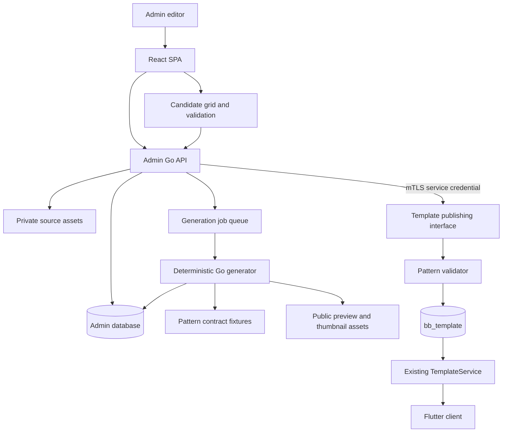
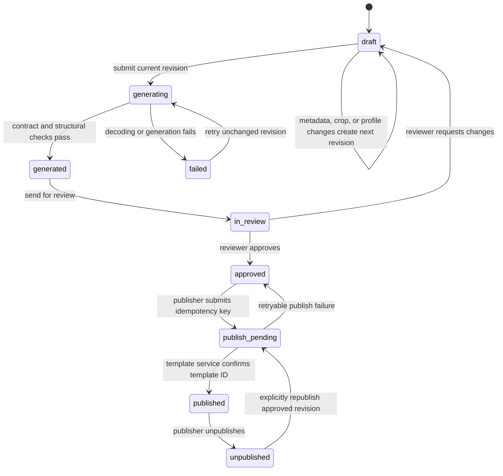
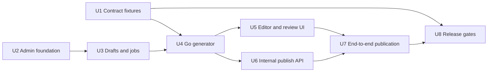

# feat: Add separate admin template platform

**Target repositories:** new `bobobeads-admin` service (React management UI and Go API/worker), existing `bobobeads_server` (the sole owner of `bb_template` writes), the Flutter client repository, and a versioned `bobobeads-pattern-contract` fixture repository. Paths below are relative to the repository named in each unit.

## Summary

Create a separate management platform that turns uploaded source images into versioned, client-compatible `PatternData`, lets authorized staff review the result, and publishes it through the existing template service into `bb_template`. The UI never produces authoritative pixels; the Go generator does, and publication is blocked unless its output matches the Flutter contract fixtures.

## Problem Frame

The existing client generates a pattern locally, then serializes it as a row-major indexed grid plus its color palette. The existing service already persists that structure in `bb_template.pattern_data` and returns it from `GetTemplate`, but it has no trusted path for creating official templates.

Copying the browser crop result or allowing a new service to write shared tables directly would make the published data hard to audit and easy to diverge from the Flutter implementation. Pixel interpolation, palette ordering, CIEDE2000 matching, alpha handling, and Floyd–Steinberg rounding are all behavior, not presentation details. The platform must make them explicit, versioned, and continuously verified.

---

## Requirements

### Management workflow

- R1. Authorized staff can upload an image, choose a crop, target grid size, palette brand, color limit, and smoothing setting, then generate a server-side candidate.
- R2. The UI shows the candidate grid, color/material usage, original/crop/preview assets, validation results, and template metadata before a reviewer publishes it.
- R3. Staff can list, search, edit, republish, and unpublish official templates without deleting historical publication records.
- R4. Uploaded source assets remain private; only reviewed preview and thumbnail assets become client-facing CDN URLs.

### Generation compatibility

- R5. The Go generator produces the same `PatternData` semantics as the pinned Flutter generation path for the same image bytes and generation options.
- R6. A published payload uses schema version 1, row-major `pixels`, index `0` for transparent cells, and one-based palette indexes with Flutter-compatible brand, code, name, and hex fields.
- R7. Changes to any conversion rule or color catalog create a new immutable generator profile; existing published templates retain their recorded profile and data.
- R8. Publishing fails closed when generation output, dimensions, color references, or preview metadata do not pass validation.

### Service boundary and client availability

- R9. `bobobeads-admin` never receives database credentials that can mutate `bb_template`; it calls a service-to-service publishing interface owned by `bobobeads_server`.
- R10. The existing client-facing template APIs remain backward compatible. A newly published active template appears through the existing listing/detail flow and its `PatternData` decodes in the current Flutter client.
- R11. Publication is idempotent across timeouts and retries, and an unpublish hides a template from every client-facing list, detail, and favorite query by status instead of removing the row or user favorites.
- R12. All identity, generation, review, publish, unpublish, and retry events are attributable to an admin actor and request identifier.

### Operational safety

- R13. The platform enforces file type, decoded dimensions, pixel count, upload-size limits, private-source retention, and credential rotation before production use; it records failures without exposing source images or service credentials.

---

## Scope Boundaries

### In scope

- A new browser-based management service with a React/TypeScript SPA and Go API/worker.
- A desktop-first editorial UI; narrow-screen template editing is deferred, while authentication and read-only status views remain usable.
- Admin accounts, role-based permissions, audit records, source/derivative asset management, draft/review/publish lifecycle, and category selection from the template service.
- A deterministic Go port of the currently used Flutter conversion behavior and a cross-repository compatibility test suite.
- A private internal publishing interface and the smallest changes needed in `bobobeads_server` to validate and write `bb_template` transactionally.

### Deferred to Follow-Up Work

- AI style transformation, automatic background removal, denoising, and saturation adjustment. The current client screens expose some of these controls but the located generation path does not apply them, so the first admin release must not present them as functional conversion options.
- Bulk image import, multi-step editorial approval, scheduled publishing, localization, and category-creation UX.
- Rewriting the existing client to generate patterns on the server. It remains a local generator; this work makes its behavior a tested compatibility contract.

### Non-goals

- Sharing a writable database account between the two services.
- Treating a preview PNG as the source of truth for a pattern.
- Changing the public `TemplateService` contract or storing arbitrary browser-generated pixel buffers in `bb_template`.

---

## Key Technical Decisions

- KTD1. **The Go generator is authoritative for management-platform output.** The browser submits image/crop/options and only renders returned candidates, preventing JavaScript canvas and backend outputs from silently diverging.
- KTD2. **Flutter fixtures, not visual comparison, define compatibility.** The contract compares `PatternData` field-for-field and checks the final Flutter decode/render path; preview images are secondary artifacts.
- KTD3. **Publish through `bobobeads_server`, not a shared database.** The existing service validates the payload and owns the `bb_template` transaction, status transition, and idempotency record.
- KTD4. **Generation profiles are immutable.** A profile captures the algorithm version, exact ordered palette snapshot and digest, target dimensions, color limit, smoothing policy, and source-processing rules. Changing any item creates a new profile instead of changing published output retroactively.
- KTD5. **Draft, candidate, and published data are different records.** Admin drafts and job history live in the admin database; only an approved canonical payload and public derivative URLs cross into `bb_template`.
- KTD6. **Public template visibility is status-aware on every read surface.** Publish sets the template active only after validation; unpublish sets it inactive, preserving template IDs and favorite relationships while excluding it from gallery, detail, and favorite responses.
- KTD7. **The first release uses local admin accounts.** Store a modern adaptive password hash and server-side sessions in the admin database; a future OIDC integration can map into the same role model without changing publishing permissions.
- KTD8. **The admin SPA and API share one site origin.** Secure HttpOnly session cookies, CSRF protection, and service credentials remain outside browser code; the SPA calls only its own `/api` routes.
- KTD9. **A tagged fixture repository is the sole cross-language compatibility source.** The Flutter and Go repositories pin the same read-only contract revision in CI; neither keeps an independently editable copy of expected pixels.

---

## High-Level Technical Design



The authoritative data path is `source asset → server generator → candidate PatternData → reviewer approval → template-service validation → bb_template`. A preview PNG or a browser canvas is never read back into the pipeline.

### Editorial and publication lifecycle



Only the current generated revision may enter review. Any edit to metadata that affects client-visible data, crop coordinates, source asset, or generation profile creates a new revision and invalidates its predecessor's candidate/approval.

### Generation contract

For profile `flutter-pattern-v1`, implement and test the following behavior from the current Flutter sources:

1. Decode the source and apply the selected integer crop rectangle and horizontal flip with the same semantics as the client crop service.
2. Scale the cropped image to the target bead grid with linear interpolation. Preserve aspect ratio, center it on a transparent RGBA canvas, and leave letterboxed cells transparent.
3. Resolve the ordered color palette from the immutable profile snapshot. First apply the image-aware color limit: rank candidate colors by nearest-match pixel count, then by lower average distance.
4. Match each non-transparent cell with CIEDE2000, preserving the first palette entry on a distance tie.
5. When smoothing is enabled, diffuse the RGB quantization error left-to-right using the client weights `7/16`, `3/16`, `5/16`, and `1/16` at hardness 50. Clamp and round each propagated channel with the same observable result as Flutter.
6. Emit the constrained palette in its selected order, use one-based indexes for non-transparent cells, and emit `0` for transparent cells. Derive bead count and used color count from this indexed grid.

The contract fixture is the release gate for decoder-orientation, crop rounding, resize interpolation, alpha, tie-breaking, ordering, and error-diffusion edge cases. Do not declare a Go image package "equivalent" without passing those fixtures.

---

## Output Structure

```text
bobobeads-admin/
├── apps/web/                       # React/TypeScript SPA
├── cmd/admin-api/                  # HTTP API and worker entry point
├── testdata/pattern-contract/      # pinned read-only fixture repository
├── internal/auth/                  # admin sessions, roles, CSRF
├── internal/assets/                # private/public object storage boundary
├── internal/catalog/               # draft, review, and publication records
├── internal/generator/             # deterministic image-to-PatternData engine
├── internal/jobs/                  # durable generation worker
├── internal/publisher/             # mTLS client for template service
├── internal/audit/                 # append-only audit events
├── migrations/                     # admin schema migrations
└── tests/                          # API, integration, and browser tests
```

`bobobeads-pattern-contract` contains the versioned source images, options, expected canonical payloads, manifest digests, and compatibility notes. The existing service retains its current layout. It gains a narrow internal template-publishing surface, a persistence model for idempotent publication, and tests beside the existing template and pattern tests.

---

## Implementation Units

### U1. Establish the cross-client pattern contract

- **Goal:** Make the current Flutter behavior executable as a versioned, shared compatibility specification before porting it to Go.
- **Requirements:** R5, R6, R7, R8, R10.
- **Dependencies:** None.
- **Files:**
  - **Contract repository:** `v1/manifest.json`, `v1/images/`, `v1/expected/`, `v1/README.md`.
  - **Flutter repository:** `testdata/pattern-contract/`, `test/pattern_contract/pattern_contract_test.dart`, `tool/verify_pattern_contract.dart`.
  - **Admin repository:** `testdata/pattern-contract/`, `internal/generator/contract_test.go`.
- **Approach:** Freeze a fixture manifest containing source image bytes, crop/flip parameters, ordered palette snapshot, grid and generation options, and expected canonical `PatternData`. Both implementation repositories pin the same tagged contract revision as a read-only test-data dependency. Generate or update that tag only through an explicit Flutter contract-update review. Cover a transparent letterbox, a flipped asymmetric crop, color-limit ranking, CIEDE2000 near-ties, smoothing on/off, and boundary error diffusion. Record the Flutter `image` package version and a content digest for each fixture set.
- **Patterns to follow:** `PatternData.fromGeneratedPattern` defines palette index assignment and `work.PatternDataToJSONMap` defines persisted field names.
- **Test scenarios:**
  - Run each fixture through the Flutter path and assert every indexed cell and palette field equals the checked-in expected payload.
  - Fail CI when the Flutter and admin repositories pin different contract revisions.
  - Assert a fixture with identical RGB values but different palette order preserves the first matching entry.
  - Assert transparent pixels remain index `0` and do not affect usage statistics.
  - Reject a fixture update whose manifest digest, expected dimensions, or schema version is inconsistent.
- **Verification:** Every contract fixture can be reproduced from the pinned Flutter source with no manually edited expected pixels.

### U2. Bootstrap the standalone admin service and identity boundary

- **Goal:** Create a separately deployable React/TypeScript and Go service that exposes a same-origin, authenticated management UI.
- **Requirements:** R1, R2, R9, R12, R13.
- **Dependencies:** U1.
- **Files:**
  - **Admin repository:** `apps/web/package.json`, `apps/web/src/main.tsx`, `apps/web/src/app/router.tsx`, `apps/web/src/features/auth/`, `cmd/admin-api/main.go`, `internal/http/router.go`, `internal/auth/service.go`, `internal/auth/middleware.go`, `internal/config/config.go`, `internal/audit/service.go`, `migrations/001_admin_identity.sql`, `tests/auth_integration_test.go`.
- **Approach:** Use a React/TypeScript SPA for the management UI and a Go HTTP API/worker service. Host both behind one `admin` origin, with the reverse proxy routing `/api` to Go. Implement local admin accounts with adaptive password hashes, server-side sessions, and role checks for operator, reviewer, publisher, and administrator. Bootstrap the first administrator only from deployment-time secrets. Require CSRF validation for state-changing browser requests, rate-limit login and upload-initialization routes, and never send template-service credentials to the browser.
- **Patterns to follow:** Reuse the current service's configuration separation and structured error conventions, but do not reuse end-user JWT trust for service-to-service publishing.
- **Test scenarios:**
  - An unauthenticated user cannot list drafts or access assets.
  - An operator can create/edit a draft but cannot publish or unpublish it.
  - A publisher can publish an approved candidate; every mutation writes actor, request ID, target, and outcome to the audit log.
  - Cross-site state-changing requests fail CSRF validation.
  - Repeated failed login attempts and upload-initialization bursts are throttled without preventing an authorized editor from resuming normal work.
- **Verification:** A fresh deployment can create an admin session, enforce roles, and produce an auditable mutation trail without exposing internal credentials in SPA bundles or logs.

### U3. Persist drafts, assets, profiles, and durable generation jobs

- **Goal:** Give the new service a reliable editorial lifecycle without polluting `bb_template` with unfinished work.
- **Requirements:** R1, R2, R4, R7, R12, R13.
- **Dependencies:** U2.
- **Files:**
  - **Admin repository:** `migrations/002_template_catalog.sql`, `internal/catalog/model.go`, `internal/catalog/repository.go`, `internal/catalog/service.go`, `internal/assets/service.go`, `internal/jobs/model.go`, `internal/jobs/repository.go`, `internal/jobs/worker.go`, `internal/http/template_handler.go`, `tests/catalog_service_test.go`, `tests/assets_integration_test.go`.
- **Approach:** Store `template_draft`, immutable draft revisions, `generation_profile`, `generation_run`, `asset`, `review`, `publication`, and `audit_event` records in the admin database. Give each revision an optimistic version and make jobs, reviews, and publication requests reference that immutable version. Store source images under a private object prefix and derived previews/thumbnails under a public prefix only after candidate validation. Accept only JPEG, PNG, and WebP after MIME sniffing, decoder verification, maximum decoded dimensions/pixels, and size limits; reject vectors and animated/multi-frame input for the first release. Serve a source preview only through an authenticated, short-lived read URL or API proxy, never by exposing its object-store key. Give each private asset a configured retention timestamp; a purge worker removes expired source bytes and retains only the audit-safe digest/metadata required for traceability. Queue generation by draft revision so retries cannot overwrite a newer revision.
- **Patterns to follow:** Preserve the current service's status-based visibility model; use explicit statuses for draft, generating, generated, in_review, approved, publish_pending, published, failed, and unpublished.
- **Test scenarios:**
  - A malformed image, oversized decoded image, or media-type mismatch never creates a runnable job.
  - SVG, animated input, and an image whose claimed MIME type differs from its decoded type are rejected before any private URL is issued.
  - Retrying a failed job for the same revision reuses the same source/profile but records a new attempt; a newer draft revision is not overwritten.
  - A source asset URL is unavailable publicly, while a published preview URL is stable and CDN-addressable.
  - A staff member with the correct role receives a short-lived source-preview URL; a logged-out user, a user without draft access, and an expired URL cannot fetch it.
  - An expired private source is purged by the retention worker, cannot be fetched afterward, and leaves only non-sensitive audit metadata.
  - A profile cannot be edited after it has produced or published a run.
- **Verification:** Draft records, source assets, job attempts, reviewer decisions, and publications can be traced from one draft revision without any write to `bb_template`.

### U4. Port the deterministic generator to Go

- **Goal:** Produce canonical `PatternData` and derived preview artifacts from a draft revision using the U1 contract.
- **Requirements:** R5, R6, R7, R8, R13.
- **Dependencies:** U1, U3.
- **Files:**
  - **Admin repository:** `internal/generator/profile.go`, `internal/generator/decode.go`, `internal/generator/crop.go`, `internal/generator/resize.go`, `internal/generator/lab.go`, `internal/generator/ciede2000.go`, `internal/generator/palette.go`, `internal/generator/dither.go`, `internal/generator/pattern_data.go`, `internal/generator/preview.go`, `internal/generator/generator_test.go`, `internal/generator/contract_test.go`.
- **Approach:** Implement the contract in isolated stages so crop, resize, palette selection, color distance, dithering, and serialization can be tested independently. Use a profile-owned palette snapshot rather than fetching a mutable external CSV during a job. Validate decoded images before allocating target buffers. Render preview/thumbnail images only from the canonical indexed grid and palette after the grid has passed contract and structural validation.
- **Patterns to follow:** Flutter's `CropService`, `ImageService.resizeAndGetPixels`, `PaletteConstraintService.applyImageAwareColorLimit`, `reduceColor`, and `PatternData.fromGeneratedPattern` are the behavioral references.
- **Test scenarios:**
  - Every U1 golden fixture produces byte-for-byte equal canonical JSON fields and the same palette ordering.
  - Crop, horizontal flip, non-square target, transparent padding, smoothing enabled, smoothing disabled, and a maximum allowed grid each succeed with expected grid dimensions.
  - Decoder errors, unsupported image dimensions, a missing/empty palette, invalid profile digest, and a generated palette index outside the catalog fail before candidate publication.
  - Preview generation preserves color/index semantics but a preview-render failure cannot alter the canonical grid.
- **Verification:** The Go contract suite passes against all Flutter fixtures, and any mismatch exposes the stage and first differing cell before the candidate reaches review.

### U5. Build the editor, review, and template-management UI

- **Goal:** Give staff a safe, inspectable workflow from upload through review and post-publication management.
- **Requirements:** R1, R2, R3, R4, R8, R12.
- **Dependencies:** U2, U3, U4.
- **Files:**
  - **Admin repository:** `apps/web/src/features/templates/list/`, `apps/web/src/features/templates/editor/`, `apps/web/src/features/templates/review/`, `apps/web/src/features/templates/detail/`, `apps/web/src/features/assets/`, `apps/web/src/components/PatternGridPreview.tsx`, `apps/web/src/components/CropEditor.tsx`, `apps/web/src/services/adminApi.ts`, `apps/web/src/test/template-editor.spec.tsx`, `apps/web/e2e/template-publish.spec.ts`.
- **Approach:** Implement a template list with status/category/search filters and an editor wizard: metadata, upload/crop, generation options, candidate review, approval, and publish. The crop component submits source-pixel crop coordinates plus flip state; it does not resample the image. Provide numeric crop inputs alongside pointer manipulation and keyboard-accessible actions. Show the server-returned grid, palette codes, per-color counts, input profile, validation status, preview, and thumbnail. Warn on a stale candidate whenever a draft, crop, or profile input changes.
- **Patterns to follow:** Use the existing client’s indexed grid semantics for the preview, not a lossy screenshot of the source image.
- **Test scenarios:**
  - Selecting a crop or changing any generation option invalidates the earlier candidate and disables approval/publish until a new job succeeds.
  - The candidate preview displays transparent cells, palette codes, and usage from the API's canonical `PatternData`.
  - The editor supports keyboard navigation and accessible labels for metadata, crop values, validation state, role-disabled actions, and job errors.
  - An operator sees publication controls disabled; a reviewer can approve but cannot publish; a publisher can publish an approved, current revision only.
  - List search, status filters, edit, and unpublish flows preserve the expected template identifier and audit history.
- **Verification:** A browser test completes the normal editorial flow without making a direct database call or treating a canvas bitmap as authoritative data.

### U6. Add an internal, idempotent template-publishing interface to the existing service

- **Goal:** Make `bobobeads_server` the single authority that validates and writes client-visible template rows.
- **Requirements:** R6, R8, R9, R10, R11, R12.
- **Dependencies:** U4.
- **Files:**
  - **Existing service repository:** `pkg/proto/admin_template.proto`, `internal/api/admin_template.go`, `internal/api/template.go`, `internal/service/template/admin_service.go`, `internal/service/template/service.go`, `internal/dao/template.go`, `internal/model/work.go`, `internal/model/template_publish_record.go`, `internal/bootstrap/service_provider.go`, `internal/middleware/service_auth.go`, `cmd/main.go`, `internal/test/admin_template_test.go`, `internal/test/template_test.go`.
- **Approach:** Add an internal-only gRPC service with no public HTTP gateway annotation. Authenticate only the admin service by mTLS identity plus a scoped service credential. Accept canonical `PatternData`, category and display metadata, public derivative URLs, a draft revision ID, and an idempotency key. Reuse the existing pattern structural validator after extracting it from the work-specific package into a neutral internal pattern package. In one transaction, validate the payload, derive stored dimensions and color count, insert or update `bb_template`, and record the idempotency key with its template ID. Return the original result for a safe retry. Unpublish changes the existing status to inactive, and update the public detail/favorite DAO queries so inactive rows cannot remain reachable through a previously known ID or a favorite record.
- **Patterns to follow:** `work.ValidatePatternData`, `work.PatternDataToJSONMap`, `TemplateDAO`, `TemplateService.GetTemplate`, and the existing status filter in template listing.
- **Test scenarios:**
  - A valid publish creates one active template whose `pattern_data`, width, height, and color count match derived values.
  - Invalid schema version, non-row-major pixel length, duplicate palette indexes, unknown palette references, mismatched metadata, and malformed URLs are rejected without inserts.
  - Repeating the same idempotency key returns the same template ID and never creates a duplicate; a conflicting reuse fails.
  - Unpublish removes the template from active listing, public detail, and favorite responses while preserving administrative recovery history.
  - An end-user JWT and an unauthenticated caller cannot invoke the internal publishing service.
- **Verification:** The only write path from the new platform into `bb_template` is an authenticated, validated, transactional service call.

### U7. Connect publication, client-read validation, and recovery behavior

- **Goal:** Complete the cross-service state machine and prove the current client can consume every published template.
- **Requirements:** R3, R8, R10, R11, R12.
- **Dependencies:** U5, U6.
- **Files:**
  - **Admin repository:** `internal/publisher/client.go`, `internal/catalog/publication_service.go`, `internal/jobs/publish_reconciler.go`, `internal/http/publication_handler.go`, `tests/publish_end_to_end_test.go`.
  - **Existing service repository:** `internal/test/admin_template_test.go`, `internal/test/template_test.go`.
  - **Flutter repository:** `test/pattern_contract/published_template_compatibility_test.dart`.
- **Approach:** The admin API sends a publish request only for the approved candidate revision. Persist a publish-pending record before the RPC, reconcile uncertain outcomes by idempotency key, and mark the revision published only after the template service returns its ID. Test the returned `GetTemplate` payload with Flutter's `PatternData.fromJson` and `toGeneratedPattern` path. For an unpublish, synchronize the admin publication status only after the template service confirms the inactive status.
- **Patterns to follow:** The Flutter `GenerationCompletionService` and `PatternData` serialization provide the existing producer/consumer contract; the template detail handler is the client read boundary.
- **Test scenarios:**
  - Upload through publish creates an active template that the existing public list returns and Flutter decodes into the expected grid and palette.
  - A timeout after the template service commits is reconciled to the same template ID without a duplicate.
  - A failed publish leaves the candidate approved and retryable, not falsely marked published.
  - A published revision cannot be replaced by a stale draft revision; a newly edited revision requires regeneration, review, and another explicit publish.
  - Unpublishing removes it from gallery, direct detail, and favorite surfaces while the audit record retains actor, reason, and prior template ID.
- **Verification:** The end-to-end suite proves `admin draft → bb_template → TemplateService → Flutter decode` for every supported generator profile.

### U8. Add release gates, observability, and secure deployment configuration

- **Goal:** Make parity regressions, failed jobs, unsafe uploads, and publishing failures visible before they affect client users.
- **Requirements:** R7, R8, R11, R12, R13.
- **Dependencies:** U1 through U7.
- **Files:**
  - **Admin repository:** `internal/metrics/metrics.go`, `internal/health/health.go`, `deploy/admin-api.yaml`, `deploy/admin-web.yaml`, `deploy/worker.yaml`, `deploy/secrets.example.yaml`, `.github/workflows/contract.yml`, `.github/workflows/admin-ci.yml`, `docs/runbooks/template-publication.md`.
  - **Existing service repository:** `conf/conf.go`, `conf/server.yaml`, `docs/runbooks/internal-template-publishing.md`, `internal/test/admin_template_test.go`.
- **Approach:** Require the Flutter/Go contract suite, admin API integration tests, and publish-to-client compatibility test before release. Emit metrics for upload rejection, generator duration, fixture mismatch, job retry, publish success/failure, reconciliation, and unpublish. Add health checks for database, object storage, queue, and template-service connectivity. Provide separate least-privilege credentials and bucket prefixes for the admin service; load them through deployment secret management rather than copying any development configuration into the new service. Require configured source-retention periods and support overlapping current/next mTLS credentials during rotation so a certificate change does not interrupt a publish job.
- **Patterns to follow:** Keep existing public template endpoints stable and retain their current pattern size/color limits as a final defense-in-depth validator.
- **Test scenarios:**
  - CI fails on any Flutter/Go contract mismatch or a client decode failure.
  - A dependency outage marks a generation or publication retryable, increments the relevant metric, and does not expose a source asset URL.
  - A readiness check fails when the internal publishing credential or required storage target is unavailable.
  - A deployment with missing retention configuration or an invalid next mTLS credential never becomes ready; rotating from current to next credentials keeps an in-flight publication retryable.
  - Configuration examples contain placeholders only and production secrets are absent from logs, SPA artifacts, and repository files.
- **Verification:** Operators can identify a failed stage, safely retry it, unpublish a bad template, and verify the public client path without database intervention.

---

## Dependency Order



---

## System-Wide Impact

- **Data:** `bb_template` remains the client-visible template table and stores only published, structurally valid `PatternData`. New admin tables hold editorial state; the existing service gains an idempotency/publication record.
- **API:** Public `TemplateService` remains read/favorite-only and backward compatible, with inactive templates consistently excluded from list, detail, and favorite reads. A separate internal gRPC interface carries service-authenticated publish and unpublish commands.
- **Client:** No client feature rewrite is required for published templates. The Flutter repository gains contract and consumer tests that prevent a future generator change from breaking its grid renderer.
- **Security:** The admin service has a separate user/role model, a private source-asset namespace, and scoped service credentials. The browser never sees database or internal template-service credentials.
- **Operations:** The new worker, object prefixes, internal RPC availability, and contract test suite become deployment dependencies. An inactive status provides the immediate rollback path for a published template.

---

## Risks and Mitigations

| Risk | Mitigation |
|---|---|
| Go and Flutter differ by one pixel because of interpolation, crop rounding, color-distance arithmetic, or error diffusion. | Freeze fixture inputs and expected payloads from Flutter; require exact contract tests before any generator release. |
| A mutable external palette changes color ordering or codes. | Snapshot ordered palette entries and a digest inside each immutable generation profile. |
| A browser preview appears correct but persisted data is incompatible. | Generate and validate only on the Go worker; publish the canonical indexed payload, never browser pixels. |
| Network timeout creates duplicate templates or ambiguous editor state. | Use a persisted publish-pending record and template-service idempotency key/reconciliation flow. |
| An unpublished template remains available to a user who has its ID or favorite record. | Apply the existing status filter to every public template detail and favorite query; cover all three read surfaces in integration tests. |
| Direct access to a shared database bypasses client validation and auditability. | Give the new service no write grant on `bb_template`; make the existing service own all template writes. |
| User-controlled image files exhaust resources or leak source content. | Enforce byte/decoded limits, decode verification, private storage, and redacted structured errors. |

---

## Acceptance Examples

- AE1. An operator uploads an asymmetric PNG, selects a flipped crop and a 50×50 target, then generates a candidate. The candidate grid and palette exactly match the fixture associated with that profile.
- AE2. A reviewer approves the candidate and a publisher publishes it. The current template detail API returns a schema-1 payload that the Flutter client converts to a generated pattern without error.
- AE3. The publish RPC times out after a successful commit. Retrying from the admin UI returns the original template ID and shows one published template, not two.
- AE4. A publisher unpublishes a bad template. It disappears from active list, detail, and favorite responses while its ID, favorites, source revision, and audit history remain recoverable to administrators.
- AE5. An uploaded image exceeds decoded-pixel limits. The job is never queued, no public asset is created, and the audit event records the rejection category without exposing the file.

---

## Sources and Research

- Flutter crop behavior: `lib/screens/crop_screen.dart` and `lib/services/crop_service.dart`.
- Flutter resize, transparent-canvas, and linear interpolation behavior: `lib/services/image_service.dart`.
- Flutter palette ranking, CIEDE2000 matching, dithering, and channel rounding behavior: `lib/services/palette_constraint_service.dart`, `lib/algorithms/matching.dart`, `lib/algorithms/color_reducer.dart`, and `lib/models/color.dart`.
- Flutter serialization and client-consumption boundary: `lib/services/api/api_models.dart` and `lib/services/api/generation_completion_service.dart`.
- Existing server persistence and client response boundary: `internal/model/work.go`, `internal/service/work/pattern.go`, `internal/api/template.go`, `internal/dao/template.go`, `pkg/proto/work.proto`, and `pkg/proto/template.proto`.
- Existing validation coverage to extend: `internal/test/work_test.go` and `internal/test/template_test.go`.
