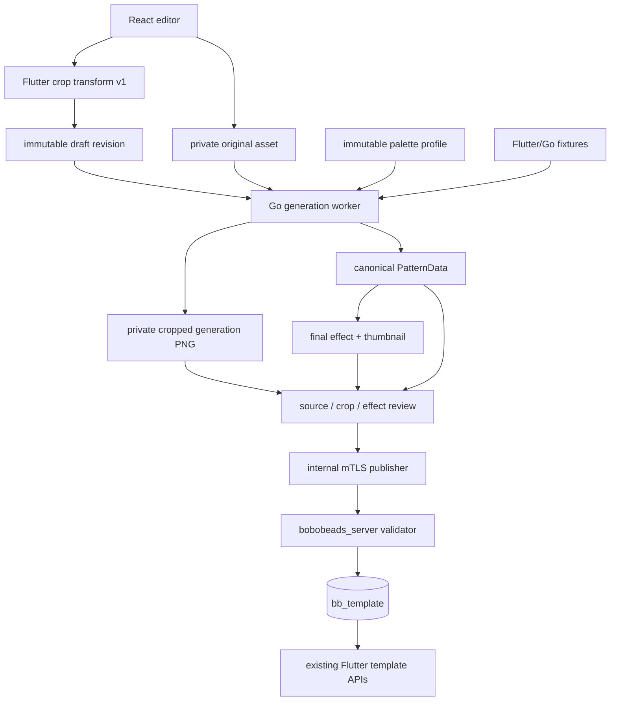
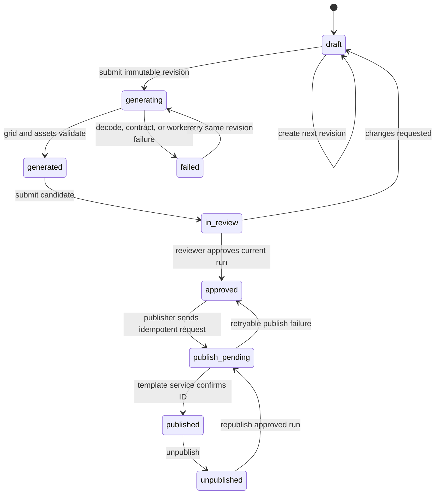

# refactor: Make admin template generation client-exact

**Document home:** `bobobeads_server`
**Target repositories:** `bobobeads-admin` (primary), `bobobeads_server` (publish authority), and `bobobeads` (Flutter compatibility authority).

## Summary

Turn the current draft editor into a usable image-to-template workflow: it must show the uploaded image and final effect image, expose every client-effective parameter, generate canonical `PatternData` in Go, and publish only a result that the Flutter client can consume unchanged.

The existing service has the right broad entities—drafts, revisions, assets, profiles, runs, reviews, and publications—but the generation path is a scaffold. The worker supplies no image or palette, the generator stages are TODOs, and the editor cannot show the image, choose a profile, or display a candidate before review.

---

## Problem Frame

The live `/templates/:id/edit` page currently exposes free numeric crop coordinates, target dimensions, a numeric color limit, two switches, and a file picker. It has no image preview or crop interaction. Its defaults (`30×30`, color limit `20`, board spec `standard`) do not describe the Flutter client's current defaults or enum values. The edit query is fetched but never hydrates the form, and `profileId` stays `0` because the UI never loads or selects a profile.

The runtime failure is expected from the current implementation: the worker does not fetch `SourceAssetID`, does not load the profile palette, and invokes the generator with `nil` image bytes; `cropImage`, `resizeImage`, `applyColorLimit`, and `matchColors` are placeholders. A browser navigation also recreates the SPA session state without restoring the CSRF token, so protected mutations cannot safely survive a refresh.

For a given source byte sequence and client-effective options, correctness means equal indexed `PatternData`, not merely a visually similar PNG. The final effect image is a required review artifact, but it must be rendered from the generated canonical grid rather than becoming a second source of truth.

---

## Requirements

**Editorial experience**

- R1. An editor can create a draft, upload a supported source image, see the source and cropped generation input, select all supported client-effective options, and save an immutable revision.
- R2. A generated run shows the original upload, the exact cropped PNG used by generation, a final effect/grid image, a thumbnail, dimensions, bead count, used-color count, color usage, generation profile, and validation result.
- R3. Editing any metadata that is published, asset, crop, palette, or generation option creates a new revision and makes the preceding candidate ineligible for approval or publication.
- R4. The list, detail, edit, review, retry, publish, and unpublish pages display durable status, errors, and actor-attributed history rather than silently resetting state.

**Client-exact generation**

- R5. Go reproduces the Flutter crop, resize, palette selection, CIEDE2000 matching, smoothing, alpha handling, palette-index assignment, and `PatternData` serialization for the same fixture bytes and options.
- R6. The editor only permits client-supported crop ratios, dimensions, color limits, palette brands, and defaults. Fixed algorithm settings remain visible as read-only provenance rather than misleading editable inputs.
- R7. Every run records an immutable generator profile containing the ordered palette snapshot, palette digest, algorithm version, and compatibility-fixture version.
- R8. A mismatch in a contract fixture, decoded source, crop bounds, palette, final grid shape, or structural payload blocks review and publication.

**Assets, publication, and security**

- R9. Source assets stay private. The UI loads them through an authenticated short-lived URL; canonical cropped input remains private; only reviewed derivative preview and thumbnail assets are publishable URLs.
- R10. The admin service publishes through the existing internal template API. `bobobeads_server` remains the only writer of `bb_template`, validates the canonical payload, and applies idempotency.
- R11. A newly active template is readable by the Flutter client's existing template APIs. An unpublished template is absent from list, detail, and favorites responses while its audit and publication history remain intact.
- R12. Browser authentication restores a valid mutation capability after reload without persisting the CSRF token in local storage; roles, audit events, and state transitions are enforced server-side.

---

## Scope Boundaries

### In scope

- Completing the existing `bobobeads-admin` React UI, Go API/worker, asset records, generator, contract tests, and publishing client.
- Showing the uploaded source image and generated final effect image at edit/review/detail stages.
- A deterministic port of the currently active Flutter generation path and a versioned cross-repository test fixture set.
- The minimal `bobobeads_server` changes required to close the internal publishing path and public visibility leaks.

### Deferred to Follow-Up Work

- AI style conversion, background removal, denoising, saturation controls, and editable dithering strength. The current client UI may mention style processing, but the active generation path does not apply it; advertising these as functional would break parity.
- Bulk import, scheduled publication, multi-reviewer quorum, category management, and user-facing template redesign.
- Byte-identical chart PNG exports across Flutter and Go. The compatibility contract is the canonical indexed grid and palette; renderer-specific typography is a derivative concern.

### Non-goals

- Direct database access from `bobobeads-admin` to `bb_template`.
- Treating a canvas image, preview PNG, or a browser-generated color grid as publishable data.
- Accepting arbitrary numeric color limits or unversioned remote palette CSV data for a run.

---

## Parameter Contract

The following is the complete v1 parameter surface. The web UI must submit a typed revision document, not the current unvalidated number fields. The API returns the normalized revision so the UI can show exactly what the worker will run.

### Editor-controlled fields

| Group | Field | Allowed value / default | Client-compatible behavior |
| --- | --- | --- | --- |
| Metadata | `title` | 1–128 characters | Published template title. |
| Metadata | `description` | 0–512 characters | Published description. |
| Metadata | `category_id` | Existing positive category ID | Required by the template service. |
| Metadata | `tags` | Comma-separated, at most 512 characters | Published tags after server normalization. |
| Metadata | `difficulty` | `1` easy, `2` medium, `3` hard; default `1` | Published difficulty. |
| Source | `source_file` | JPEG, PNG, or non-animated WebP; configured byte/pixel limits | Preserve accepted bytes and SHA-256; never resample before contract generation. |
| Source | `image_source` | `photo` default or `illustration` | Persisted provenance only in v1; it does not change generation. |
| Crop | `crop_aspect_ratio` | `square`, `landscape169`, `landscape43`, `portrait34`, `portrait916`; default `square` | Match the five ratios exposed by `CropScreen`: `1:1`, `16:9`, `4:3`, `3:4`, `9:16`. |
| Crop | `crop_ui_version` | `flutter-crop-v1` | Pins the 390×706 logical crop-stage mapping used to convert gestures to source pixels. |
| Crop | `render_scale` | Positive logical scale, clamped to the Flutter min/max rule | Persist before the final integer crop conversion. |
| Crop | `display_offset_x`, `display_offset_y` | Logical crop-stage offsets | Persist the clamped pan values, not arbitrary source coordinates. |
| Crop | `flip_horizontal` | Boolean; default `false` | Mirror the source crop x-coordinate and then flip the cropped image horizontally. |
| Output size | `product_template_id` | `small_charm`, `fridge_magnet`, `keychain`, `large_keychain`, `coaster`, `decorative_picture`, `luggage_tag`, or `custom`; default `keychain` | Resolves to the Flutter catalog dimensions. |
| Output size | `custom_bead_width`, `custom_bead_height` | Required only for `custom`; each integer 8–150 | Ignored for predefined templates. |
| Palette | `palette_brand_id` | One required brand listed below | Selects the full ordered palette snapshot. |
| Palette | `color_limit` | `unlimited` default, `8`, `16`, `24`, or `32` | Never accept the current invalid default `20`. |
| Rendering | `smoothing_enabled` | Boolean; default `true` | Enables client smoothing/error diffusion at the fixed hardness below. |

The predefined output dimensions are `16×16`, `24×24`, `32×32`, `40×40`, `48×48`, `64×64`, and `64×96` respectively. `board_spec` is derived as `"<width>x<height>"`; editors never enter `standard` manually.

The exact permitted `palette_brand_id` values are `hama`, `hama_mini`, `hama_maxi`, `nabbi`, `mard`, `artkal_a`, `artkal_c`, `artkal_m`, `artkal_r`, `artkal_s`, `perler`, `perler_mini`, `perler_caps`, `yant`, and `diamondDotz`. The profile snapshot preserves the Flutter prefixes and the Perler code normalization, so a later remote CSV change cannot change an existing revision.

### Derived and locked fields

| Field | Value | Why it is not an editor input |
| --- | --- | --- |
| `crop_display_width`, `crop_display_height` | Derived from the selected ratio on the logical Flutter crop stage | Required to repeat Flutter rounding exactly. |
| `crop_x`, `crop_y`, `crop_width`, `crop_height` | Integer source-pixel rectangle derived from the crop transform | Stored for audit and worker efficiency; the transform remains the authoritative intent. |
| `generation_input_asset_id` | Private PNG emitted by the exact crop stage | This is the byte sequence passed to resize and palette matching. |
| `style_mode` | `none` | Current client style conversion does not alter generation bytes. |
| `resize_interpolation` | `linear` | Matches Flutter `Interpolation.linear`. |
| `resize_fit`, `resize_center` | Both `true` | Preserves aspect ratio and centers on a transparent RGBA target canvas. |
| `matching_algorithm` | `cie2000` | The client fixes this algorithm for the active generation path. |
| `dithering_hardness` | `50` | The client passes a fixed 50 when smoothing is enabled. |
| `algorithm_version` | `flutter-pattern-v1` | Bumps only with an approved contract change. |
| `schema_version` | `1` | Required payload schema. |
| `board_spec` | Derived `<width>x<height>` | Must agree with final dimensions. |

### Required assets and result artifacts

| Artifact | Visibility | Purpose | UI placement |
| --- | --- | --- | --- |
| Original source | Private | Audit input and editor reference | Editor, review, detail. |
| Cropped generation PNG | Private | Exact client-equivalent input to resize/matching | Editor and review side-by-side with original. |
| Final effect preview | Public only after validation | Bead/grid rendering derived from canonical `PatternData` | Editor result panel, review, detail, and client template preview. |
| Thumbnail | Public only after validation | Compact derivative of the final effect preview | List and client cards. |
| Canonical `PatternData` | Database JSON | Client-readable grid, one-based palette and transparent index `0` | Review inspector and publish request. |

---

## Key Technical Decisions

- KTD1. **Persist Flutter crop intent and its derived rectangle.** The web cropper operates in the same logical 390×706 coordinate system and saves the transform fields used by Flutter before saving the rounded source rectangle. This prevents responsive browser geometry from changing crop output.
- KTD2. **Generate from the private cropped PNG, not from a browser canvas.** Go creates the crop with the Flutter formula, stores that PNG, and feeds its bytes into the resize stage. The uploaded original remains visible, but cannot bypass the reproducible crop stage.
- KTD3. **Use a typed enum contract for all options.** `20`, `standard`, arbitrary dimensions, and profile `0` are rejected. Client defaults are `square`, `keychain` (`32×32`), `unlimited`, `smoothing_enabled=true`, and no palette until one is selected.
- KTD4. **Profiles are immutable palette snapshots.** A profile holds the ordered palette entries, their digest, brand ID, algorithm version, and fixture revision. Workers never download mutable palette data during generation.
- KTD5. **`PatternData` is the only authority.** Final effect and thumbnail images are rendered after canonical grid validation. Reviewers compare source/crop/effect, but publication uses the validated grid, not an image URL.
- KTD6. **Use client fixtures as the compatibility gate.** The Go port is acceptable only when crop output, final indexes, palette order, alpha cells, and counts match the Flutter path for shared fixtures; visual comparison alone cannot pass a release.
- KTD7. **Restore sessions through a CSRF bootstrap endpoint.** Keep CSRF in memory, add an authenticated endpoint that returns a fresh token after reload, and have the SPA hydrate identity plus token before enabling mutations.
- KTD8. **Publish and unpublish remain internal RPC operations.** The admin publisher completes its gRPC client with mTLS and reconciliation; `bobobeads_server` validates and writes `bb_template`, including status filtering on all public reads.

---

## High-Level Technical Design

The editor may optimistically render a local crop overlay, but it always replaces that view with worker-returned assets and `PatternData` before the reviewer can approve. The worker runs the same stages used by Flutter: decode → crop/flip → resize to transparent canvas → image-aware palette limit → CIEDE2000 → optional fixed-strength error diffusion → indexed serialization.

---

## Current-State Gap Matrix

| Observed area | Current behavior | Required correction |
| --- | --- | --- |
| Editor | Fetches a draft but never applies it to form state; no source/crop/final image is rendered | Hydrate revision data and use a staged source/crop/result panel. |
| Editor options | Numeric crop values, `30×30`, color limit `20`, manual `standard`, hidden profile `0` | Replace with the parameter contract above and profile selector/provenance. |
| Generator | Decode/crop/resize/palette/match stages are TODOs | Implement and fixture-gate every stage before enabling publish. |
| Worker | Ignores object storage and profile data, then calls `Generate(nil, ...)` | Fetch verified source bytes and immutable profile; persist assets and structured failure. |
| Review/detail | Review can show a grid and optional preview only; detail shows no assets or candidate provenance | Always show original, crop, final effect, profile, run, and validation report. |
| SPA reload | Session identity and in-memory CSRF token are not rehydrated | Bootstrap authenticated identity and a fresh CSRF token before routing/mutation. |
| Publisher | Uses insecure transport and stubbed publish/unpublish/reconcile methods | Implement generated RPC client, mTLS, deadline, retry/reconcile, and error classification. |

---

## Implementation Units

### U1. Define the normalized revision and immutable profile contract

- **Goal:** Replace loosely typed crop settings with the complete client-compatible parameter document and migration-safe records.
- **Requirements:** R1, R3, R6, R7, R8.
- **Dependencies:** None.
- **Files:**
  - **Admin:** `internal/catalog/model.go`, `internal/catalog/service.go`, `migrations/002_template_catalog.sql`, new migration under `migrations/`, `internal/http/handlers.go`, `internal/generator/profile.go`, `tests/catalog_revision_test.go`.
  - **Flutter reference:** `lib/models/draft_project.dart`, `lib/models/product_template.dart`, `lib/models/color_limit.dart`, `lib/services/palette_service.dart`.
- **Approach:** Introduce a versioned revision payload containing every editor-controlled and derived field in the Parameter Contract. Store an immutable profile reference and a copy of its digest/algorithm/fixture values on the revision. Backfill or reject legacy revisions with `color_limit=20`, `board_spec=standard`, profile `0`, or incomplete crop data; do not silently reinterpret them as client-compatible. Derive dimensions and board spec from the selected product template, not from manual fields.
- **Patterns to follow:** Flutter `DraftProject` defaults, `ProductTemplateCatalog`, `ColorLimit`, and `PaletteService` definitions.
- **Test scenarios:**
  - Create a `keychain` revision and receive `32×32` plus `board_spec=32x32`.
  - Create each predefined template and assert its mapped dimensions; `custom` accepts exactly 8–150 per axis and rejects 7 or 151.
  - Accept only the five crop ratios, fifteen palette brand IDs, and five color-limit values including `unlimited`.
  - Reject profile `0`, unsupported palette IDs, `20`, mismatched board spec, missing crop-transform fields, and a mutable profile update after a run exists.
  - Updating source, crop, template, palette, limit, smoothing, or published metadata creates a next revision and marks the previous candidate stale.
- **Verification:** A persisted revision fully describes a repeatable Flutter-v1 generation run without any UI-only defaults.

### U2. Implement the Flutter-equivalent Go image pipeline

- **Goal:** Replace the placeholder generator with deterministic crop, resize, palette, matching, smoothing, and serialization stages.
- **Requirements:** R5, R6, R7, R8.
- **Dependencies:** U1.
- **Files:**
  - **Admin:** `internal/generator/generator.go`, new `internal/generator/crop.go`, `resize.go`, `palette.go`, `match.go`, `dither.go`, `pattern_data.go`, `profile.go`, `internal/generator/contract_test.go`, new `internal/generator/generator_test.go`.
  - **Flutter reference:** `lib/services/crop_service.dart`, `lib/services/image_service.dart`, `lib/services/palette_constraint_service.dart`, `lib/algorithms/color_reducer.dart`, `lib/algorithms/matching.dart`, `lib/services/api/api_models.dart`.
- **Approach:** Decode real source bytes, reproduce the logical transform-to-integer crop conversion and flip order, encode the cropped result as PNG, then resize with linear interpolation into a transparent RGBA canvas using Flutter floor/centering rules. Rank enabled palette entries by nearest-match count then average CIEDE2000 delta, preserve first-entry ties, diffuse errors in row-major order with 50% Floyd–Steinberg weights when smoothing is on, and serialize palette indexes one-based with transparent cells as zero. Generate `PatternData` using the exact palette fields and ordering that Flutter's `fromGeneratedPattern` uses.
- **Execution note:** Add characterization fixtures before replacing any placeholder stage; do not judge equivalence from rendered screenshots.
- **Test scenarios:**
  - An asymmetric image with flip off/on yields the same cropped PNG dimensions and all final indexes as Flutter fixtures.
  - Letterboxed cells remain transparent and serialize to index `0`.
  - A near-tie chooses the earliest palette entry; color-limit ranking breaks equal counts by lower average delta.
  - Smoothing off and smoothing on at fixed hardness 50 match their fixture outputs, including edges and channel rounding/clamping.
  - Invalid source bytes, an empty palette, a crop outside source bounds, and a target grid outside allowed dimensions fail before writing a candidate.
- **Verification:** Each shared fixture matches Flutter `PatternData` field-for-field, including `pixels`, palette entries, dimensions, board spec, bead count, and used-color count.

### U3. Make the worker and asset lifecycle real

- **Goal:** Feed verified private bytes and immutable palettes into the generator, then persist all required images and run provenance.
- **Requirements:** R1, R2, R3, R7, R8, R9.
- **Dependencies:** U1, U2.
- **Files:**
  - **Admin:** `internal/jobs/worker.go`, `internal/assets/service.go`, `internal/catalog/service.go`, `internal/catalog/model.go`, `internal/http/handlers.go`, new `internal/generator/preview.go`, `tests/generation_worker_test.go`, `tests/assets_integration_test.go`.
- **Approach:** Validate MIME using decoded content, preserve the original private asset and digest, attach its ID to the immutable revision, fetch bytes in the worker, and load the frozen profile snapshot. Store the server-produced crop PNG as a private asset. Render the final effect image and thumbnail only from the validated indexed pattern and palette, then save their asset IDs/URLs on the run. Persist structured stage, retryability, first differing fixture cell when applicable, and stable job attempt data. Return signed private URLs only to authorized editors/reviewers.
- **Patterns to follow:** Existing `Asset`, `GenerationRun`, and `Worker` records; client `GenerationCompletionService` which uploads both source and pattern preview.
- **Test scenarios:**
  - A valid upload produces original, crop, final effect, and thumbnail records with the correct visibility and a completed run.
  - A JPEG/PNG/WebP with a forged content type, an animated image, an over-limit file, or a failed decode never produces a runnable revision.
  - The worker fetches the exact asset bytes and profile snapshot; deleting/changing a later profile cannot alter an enqueued revision.
  - Private original/crop URLs require a valid session and expire; public effect/thumbnail URLs are created only after pattern validation.
  - Retry records a new attempt for the same immutable revision without replacing a newer revision or its assets.
- **Verification:** The review API can always return the two requested image views—uploaded source and final effect—plus the cropped input that proves the result was generated correctly.

### U4. Rebuild the editor as a client-parameter workflow

- **Goal:** Replace raw fields with a hydrated, visual, accessible editor that cannot submit divergent options.
- **Requirements:** R1, R2, R3, R4, R6, R9, R12.
- **Dependencies:** U1, U3.
- **Files:**
  - **Admin web:** `apps/web/src/features/templates/editor/TemplateEditorPage.tsx`, new `apps/web/src/features/templates/editor/ClientCropEditor.tsx`, `GenerationOptionsForm.tsx`, `RunArtifactsPanel.tsx`, `RevisionStatusPanel.tsx`, `apps/web/src/features/templates/review/TemplateReviewPage.tsx`, `apps/web/src/features/templates/detail/TemplateDetailPage.tsx`, `apps/web/src/components/PatternGridPreview.tsx`, `apps/web/src/services/adminApi.ts`, `apps/web/src/features/auth/store.ts`, `apps/web/src/test/template-editor.spec.tsx`, `apps/web/e2e/template-workflow.spec.ts`.
- **Approach:** Load draft, latest revision, profile catalog, run, and signed asset URLs before rendering controls. Use a visual crop stage based on Flutter's logical frame and provide keyboard-accessible numeric transform fields for precision. Render fixed algorithm provenance and disallow direct edits. Show original, cropped generation PNG, final effect, indexed grid, palette/usage table, and per-run validation. Replace save/generate buttons with a revision-aware sequence: save metadata, upload/select source, save revision, generate, inspect, submit for review. Invalidate the candidate immediately when an input changes.
- **Patterns to follow:** `TemplateEditorPage`, `TemplateReviewPage`, `PatternGridPreview`, Flutter `CropScreen`, and Flutter parameter defaults.
- **Test scenarios:**
  - Opening an existing draft hydrates all metadata and normalized options instead of displaying empty defaults.
  - The UI cannot select color limit `20`, arbitrary board spec, unsupported ratio, or target dimensions that conflict with the selected product template.
  - An uploaded image appears as a signed source preview, changing crop displays a server-returned crop preview, and a completed run shows the final effect plus grid and palette usage.
  - Changing any generation-affecting option invalidates prior approval/publish controls and labels the run stale.
  - Keyboard users can edit crop values, select a palette/limit/template, read run errors, and identify disabled actions through labels and status text.
- **Verification:** A browser workflow produces a revision with both source and final effect images visible before review, without relying on a local canvas for authoritative output.

### U5. Repair authentication hydration, state transitions, and audit access

- **Goal:** Make reload-safe mutation authorization and lifecycle enforcement match the editorial UI.
- **Requirements:** R3, R4, R12.
- **Dependencies:** U1, U4.
- **Files:**
  - **Admin:** `internal/http/router.go`, `internal/http/handlers.go`, `internal/auth/middleware.go`, `internal/auth/service.go`, `internal/catalog/service.go`, `internal/catalog/model.go`, `internal/audit/service.go`, `apps/web/src/features/auth/store.ts`, `apps/web/src/app/App.tsx`, `tests/auth_integration_test.go`, `tests/catalog_transition_test.go`.
- **Approach:** Add an authenticated CSRF bootstrap/refresh response that returns a fresh token only to the HttpOnly session holder. Hydrate identity and token before protected routes render. Apply role checks consistently to user, profile, audit, draft mutation, review, and publishing operations. Implement guarded transitions for `draft`, `generating`, `generated`, `in_review`, `approved`, `publish_pending`, `published`, `failed`, and `unpublished`; validate review decisions and preserve comments. Record actor, request ID, prior status, next status, revision, run, and failure reason.
- **Test scenarios:**
  - Reloading a logged-in browser restores the identity and obtains a fresh in-memory CSRF token; POST/PUT then succeeds without storing the token in browser storage.
  - A missing/incorrect CSRF token, expired session, operator publish attempt, reviewer unpublish attempt, and invalid state transition all fail without changing data.
  - Only the current successful run can enter review; approving a stale run is rejected after a new revision exists.
  - Audit queries are restricted to permitted roles and show the complete actor and revision trail for generate, review, publish, retry, and unpublish.
- **Verification:** Refreshing or navigating directly to an edit route no longer produces an unauthenticated-looking page or a mutation capability mismatch.

### U6. Complete the internal publishing boundary and client-read safety

- **Goal:** Publish only canonical validated data into `bb_template` and make unpublish invisible everywhere the Flutter client reads templates.
- **Requirements:** R8, R10, R11.
- **Dependencies:** U2, U3, U5.
- **Files:**
  - **Admin:** `internal/publisher/client.go`, `internal/http/handlers.go`, `internal/catalog/service.go`, `tests/publish_end_to_end_test.go`.
  - **Server:** `internal/api/admin_template.go`, `internal/service/template/admin_service.go`, `internal/service/template/service.go`, `internal/dao/template.go`, `internal/api/template.go`, `internal/test/admin_template_test.go`, `internal/test/template_test.go`.
- **Approach:** Replace the publisher stubs and insecure transport with the generated internal RPC client, mTLS credentials, deadlines, idempotent retry/reconciliation, and distinct retryable/non-retryable errors. The template service derives dimensions/counts from validated `PatternData`, validates only public derivative URLs, records idempotency, and owns the `bb_template` transaction. Apply `status=active` filtering in every public list, detail, and favorites query; retain inactive rows and favorite history for administrative recovery.
- **Test scenarios:**
  - A reviewed run publishes exactly one template whose stored grid and derived statistics equal the generation run.
  - Duplicate idempotency retries return the original template ID; a conflicting request with the same key fails.
  - A malformed pattern, private source URL, stale run, missing final effect, or RPC identity failure never creates an active template.
  - Unpublishing removes the template from public list, detail, and favorites responses while the admin detail retains its publication record.
- **Verification:** The only path to an active `bb_template` row is an authenticated internal request carrying contract-valid `PatternData` and final derivative assets.

### U7. Establish release-gating fixtures and operational checks

- **Goal:** Prevent parity regressions after the implementation ships.
- **Requirements:** R5, R7, R8, R11.
- **Dependencies:** U2, U3, U6.
- **Files:**
  - **Admin:** `testdata/pattern-contract/v1/`, `internal/generator/contract_test.go`, `tests/publish_end_to_end_test.go`, deployment CI configuration.
  - **Flutter:** `testdata/pattern-contract/v1/`, `test/pattern_contract/`, `lib/services/crop_service.dart`, `lib/services/pattern_generation_service.dart`, `lib/services/api/api_models.dart`.
  - **Server:** `internal/test/admin_template_test.go`, `internal/test/template_test.go`.
- **Approach:** Version and pin shared fixtures containing source bytes, crop transform, final crop rectangle, options, palette snapshot/digest, expected canonical `PatternData`, and expected counts. Include asymmetric flip, each ratio family, letterbox transparency, all color-limit modes, smoothing on/off, tie ordering, and custom bounds. Gate admin deployment on Go fixture parity, API payload validation, and a Flutter decode/render smoke test. Emit metrics for job duration, failure stage, parity mismatch, stale review rejection, publish reconciliation, and asset-sign failure.
- **Test scenarios:**
  - The same fixture revision passes Flutter, Go generator, and template-service validation with identical grid/palette data.
  - Changing interpolation, crop rounding, palette order, CIEDE2000 behavior, alpha handling, or dithering changes a fixture and blocks release until reviewed as a contract version bump.
  - A published template fetched through the current Flutter API converts back to a renderable generated pattern without invalid indexes or missing palette metadata.
  - Monitoring distinguishes decode, crop, palette, generator, preview, review, publish, and asset delivery failures.
- **Verification:** CI catches a single-cell divergence before any deployment can publish templates that behave differently from the client.

---

## Acceptance Examples

- AE1. Given an asymmetric PNG, `portrait34`, a nonzero crop offset, `flip_horizontal=true`, `keychain`, `hama`, `16`, and smoothing on, when the admin worker generates, then its cropped PNG and canonical indexed grid equal the Flutter fixture; review shows original, crop, and final effect.
- AE2. Given a 64×96 luggage-tag template, when the source does not fill the output aspect ratio, then the final grid contains transparent index-`0` cells in the same positions as Flutter and the effect image visibly preserves that transparency.
- AE3. Given a reviewer-approved run, when an editor changes color limit from `16` to `24`, then a new revision is required and the old run cannot be published.
- AE4. Given a refreshed browser session, when an authorized operator saves a draft, then the SPA obtains a fresh in-memory CSRF token and the server attributes the mutation to that operator.
- AE5. Given a published template that is later unpublished, when the Flutter client lists templates, gets its former ID, or loads favorites, then it receives no active template; the admin detail still shows its publication and unpublish audit event.

---

## System-Wide Impact

| Consumer | Change | Protection |
| --- | --- | --- |
| Editors/reviewers | Gain visual source/crop/effect inspection and typed options | Private signed source URLs, role checks, stale-candidate locks. |
| Admin worker | Becomes the authoritative server generator | Immutable profiles, bounded decode, fixture gate, stage errors. |
| `bobobeads_server` | Receives completed internal publication calls | mTLS, idempotency, structural validation, single transaction. |
| Flutter client | Receives official `bb_template` rows without API changes | Schema v1, shared fixture parity, status filtering. |
| Operations | Must manage profile/fixture versions and private asset retention | Metrics, audit trail, explicit version/digest provenance. |

---

## Risks and Dependencies

| Risk or dependency | Mitigation |
| --- | --- |
| Go image library differs from Flutter `image` behavior | Treat fixtures as release blockers; record the Flutter image package version and add boundary fixtures before upgrades. |
| Browser crop geometry changes result | Persist logical Flutter transform plus derived source rectangle; never use CSS pixels as contract input. |
| Mutable remote palettes change output | Import/review an ordered snapshot into an immutable profile; workers use the snapshot only. |
| Private source data leaks | Use private object keys, authorized short-lived URLs, retention expiry, and redacted audit details. |
| Job retry publishes stale data | Bind every run/review/publication to one immutable revision and enforce current-run checks. |
| Internal publisher timeout duplicates a template | Use mTLS plus an idempotency record and reconciliation before retry. |
| Existing legacy drafts are malformed | Mark them legacy/failed with a readable migration reason; require a new normalized revision before generation. |

---

## Sources and Research

- **Live management UI:** `/templates`, `/templates/new`, and `/templates/1/edit` confirm the current field set and show the existing draft in `failed` status.
- **Admin editor and review:** `apps/web/src/features/templates/editor/TemplateEditorPage.tsx`, `review/TemplateReviewPage.tsx`, `detail/TemplateDetailPage.tsx`, and `components/PatternGridPreview.tsx` show missing hydration, assets, profile selection, and candidate provenance.
- **Admin runtime:** `internal/jobs/worker.go`, `internal/generator/generator.go`, `internal/http/handlers.go`, `internal/catalog/model.go`, and `internal/publisher/client.go` show the scaffolded image pipeline and incomplete RPC client.
- **Flutter authority:** `lib/screens/crop_screen.dart`, `lib/services/crop_service.dart`, `lib/services/image_service.dart`, `lib/services/pattern_generation_service.dart`, `lib/services/palette_constraint_service.dart`, `lib/algorithms/color_reducer.dart`, `lib/models/product_template.dart`, `lib/services/palette_service.dart`, and `lib/services/api/api_models.dart` define the active behavior and output schema.
